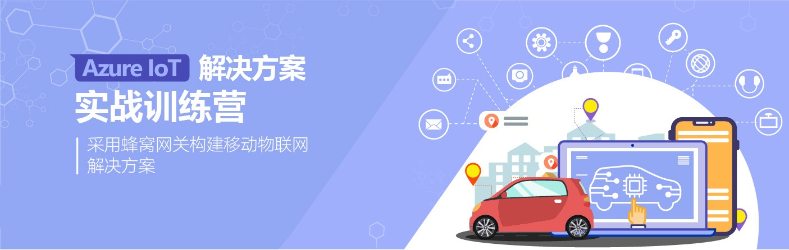

# Azure IoT 解决方案实战训练营指南💻🌏︎🚚

  

## 🚀训练营特色

- 具有行业和场景的针对性，本次**蜂窝移动物联网**主题适合在营运、物流、能源、资产追踪等场景有需求合作伙伴和客户。
- 采用商业级硬件网关和传感器进行动手实验，不再是在开发板上运行Hello world。
- 微软物联网合作伙伴**南京理学**深度参与并分享在Azure上搭建的商业解决方案。
- 训练营的核心将围绕帮助理解如何更好构建的一个基于Azure IoT PaaS的服务端架构。
- 有实际项目机会的前提下，可以赠予硬件套件和物联网SIM卡给客户进行PoC测试，并提供指导。

## 👥训练营目标人群

- 👨‍🔬物联网架构师，了解如何基于Azure PaaS的搭建服务端架构
- 👨‍💻物联网开发工程师，了解如何使用Azure PaaS服务进行物联网应用开发
- 🧕物联网产品经理，了解Azure IoT服务基础知识，寻找商业合作伙伴

## 📖准备事项

- ✅笔记本电脑，安装最新版本[Azure IoT Explorer](https://github.com/Azure/azure-iot-explorer/releases)工具
- ✅提前准备好[Azure.com](azure.com)的账号和订阅
- ✅一点点JavaScript/Node.js了解
  
> 💡免费订阅，虽然大部分实验资源是免费额度，但是仍有部分资源无法在免费订阅中使用

## 🧪实验指南

- [实验场景、需求与架构分析](architecture.md)
- [实验硬件平台介绍](hardware.md)
- [实验1：配置网关发送数据到IoT Hub](lab1-iothub.md)
- [(可选) 实验2：备份原始数据到Blob Storage](lab2-blobstorage.md)
- [实验3：编写Function实现数据解析](lab3-function.md)
- [实验4：存储时序数据到Cosmos DB](lab4-cosmosdb-in.md)
- [实验5：使用HTTP查询Cosmos DB](lab5-cosmosdb-out.md)
- [实验6：使用API Management托管API](lab6-apimgmt.md)
- [实验7：增加IoT SDK实现远程控制](lab7-iotsdk.md)

## 🌐关于微软IoT

[微软Azure IoT](https://azure.microsoft.com/en-us/overview/iot/)物联网平台由一系列Azure托管的PaaS服务构成，同时提供安全防护、设备操作系统和边缘计算软件，用于连接、监控和管理十亿的规模级的IoT资产。微软Azure IoT拥有业界最全面的服务和技术能力来赋能客户的物联网应用，提供完整的从设备、边缘侧和云上的解决方案。

## 🌐关于南京理学

[南京理学工程数据技术有限公司](www.lektec.com)是专业的物联网解决方案提供商。公司以理学为品牌，在工程机械、智慧城市、智慧物流等领域提供一体化的解决方案。南京理学构建了研发、生产、销售一体化的运营体系，拥有众多技术专利与知识产权。作为微软合作伙伴，南京理学的平台与物联网终端已经全面集成Azure IoT服务并实现商用，可为用户提供各类Azure IoT定制化软硬件解决方案。