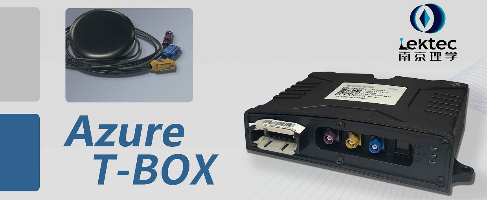

# 实验硬件平台介绍与配置

## Azure T-BOX功能介绍

LEKTEC Azure T-BOX是一款通用目的蜂窝网关T-BOX，内置eSIM支持4G LTE CAT-1全网通，支持GNSS定位和灵活可定制的CAN总线网络采集策略。用户可以根据自己对CAN网络的采集需求进行配置，实现对不同ID、不同数据类型CAN节点采集的应用。

Azure T-BOX是一个开箱即用的商业级蜂窝物联网网关产品。它通过了Azure IoT设备认证，用户可以通过其内置的WiFI热点和Webserver配置ID Scope、X509证书和私钥，通过Azure IoT Hub DPS服务接入到自己的IoT Hub节点。

## 实验硬件平台介绍

本实验硬件平台以理学Azure IoT TBox蜂窝网关终端为核心，配以总线型温湿度传感器和IO控制盒，模拟了一个真实的车载应用环境。基于此硬件平台，用户可以体验完整的遥测数据收集与远程控制过程，包括：

- 将CAN总线采集的温湿度传感器通过蜂窝无线网络传送到Azure IoT hub，完成车载数据的模拟采集
- 利用Azure IoT的Device Twin功能，通过蜂窝无线网络对实验平台进行采集模板配置，同时控制IO控制盒的四个继电器动作，模拟远程锁车场景

## 联络与采购

|||
|---|---|
|官网|www.lektec.com|
|电话|025-68093711|
|邮箱|sales@lektec.com|
|地址|江苏省南京市秦淮区永丰大道8号A座三楼

