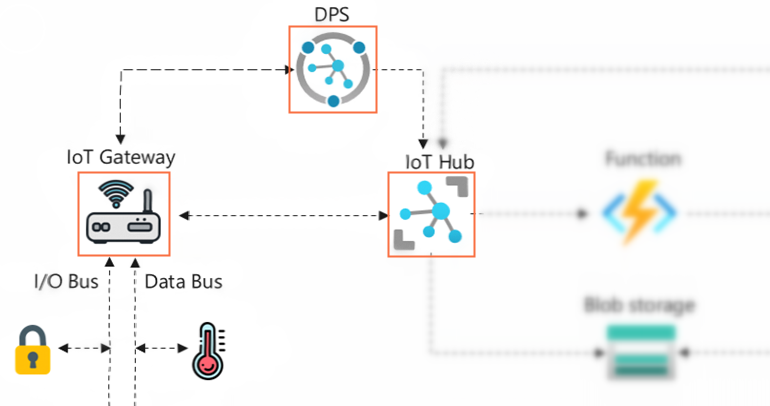

# 实验1：配置网关发送数据到IoT Hub

## 🎯实验目的

本节实验你将通过IoT Hub DPS服务把蜂窝网关实验箱注册到IoT Hub上，并配置device twin使网关从CAN总线指定地址开始采集温湿度传感器原始数据发送到IoT Hub。使用Azure IoT Explorer工具获取原始数据进行测试验证。



## 📑基础阅读

### ❔IoT Hub和IoT Hub DPS的关系

**IoT Hub**是在Azure上所有IoT解决方案都必须要用的核心服务。IoT Hub是一个云网关，它支持多种协议设备接入、设备管理以及IoT数据和控制指令的双向收发。IoT Hub不仅仅是一个MQTT broker，内置了一个Event Hub消息队列可以缓存最多7天的数据，支持Device Twin存储设备的metadata和长期状态。IoT Hub具备多种连接其他Azure服务的接口，用户可以结合Azure上其他存储、分析、机器学习等服务实现一个完整的IoT解决方案。

**IoT Hub DPS**是IoT Hub的一个配套服务，负责帮助简化在设备和服务端的Provisioning工作。通过DPS支持包括X509证书和TPM2.0在内的高安全的认证设备身份，能根据灵活的规则动态分配设备到不同的IoT Hub，无需用户干预的自动注册设备。

### ❔什么是Device Twin

Device Twin顾名思义是设备在云上的孪生体，也可以成为设备影子。它是一个JSON文档存放在IoT Hub中，保存着每个设备的metadata信息，设备端和云端分别可以读写它的某一部分内容：

- 云端更新"Desired"字段，设备可以异步的获得通知读取这些信息决定自己本地的处理逻辑。
- 设备端可以将自己的状态信息通过"Reported"字段上报到Twin中，云端也读取获得设备的状态信息。

💡用户可以把Device Twin当做设备的云上配置文件使用，有需要掉电保存的状态可以写入到Twin中，每次上电再从IoT Hub上读取状态。

💡很多IoT Hub相关的功能，包括IoT Edge，OTA，Defender等都用到了Device Twin。

## 🧪实验步骤

### 1）创建IoT Hub与IoT Hub DPS

1. Azure Portal左侧导航栏选择**Create a resource**，在**Internet of Things**分类中选择**IoT Hub**点击**Create**开启创建向导

2. **Subscription**和**Resource group**分别选择实验订阅和资源组

3. **IoT Hub name**输入一个独一无二的的名称，比如`iot-lab-hub-<your-name>`，它会成为IoT hub URL的前缀：`iot-lab-hub-<your-name>.azure-devices.net`

4. **Region**选择`East Asia`

5. 点击**Review + Create**->**Create**创建IoT Hub服务

6. 回到**Internet of Things**分类中选择**IoT Hub Device Provisioning Service**点击**Create**开启创建向导

7. **Subscription**和**Resource group**分别选择实验订阅和资源组

8. **Name**输入一个独一无二的名称，比如`iot-lab-dps-<your-name>`，它会成为IoT hub DPS URL的前缀：`iot-lab-dps-<your-name>.azure-devices-provisioning.net`

9. **Region**选择`East Asia`

10. 点击**Review + Create**->**Create**创建IoT Hub DPS服务

### 3）配置IoT Hub DPS服务

1. 进入刚刚创建的IoT Hub DPS服务，左侧导航栏选择**Linked IoT hubs**，点击**Add**

2. 在打开的窗口中，选择订阅和上一步创建的IoT Hub，点击**Save**

3. 回到IoT Hub DPS服务，左侧导航栏选择**Certificates**，点击**Add**

4. 在打开的窗口中，**Certificate name**填写一个名称，比如`iot-lab-root`，选择实验指南根本目录下的[RootCA.cer](resources/RootCA.cer)证书并勾选**Set certificate status to verified on upload**，点击**Save**上传并信任证书

   > 💡勾选**Set certificate status to verified on upload**省略随机数密钥挑战的步骤，但这样做法需要你确认上传的证书是绝对可信的。

5. 回到IoT Hub DPS服务，左侧导航栏选择**Manage enrollments**，点击**Add enrollment group**

6. **Group name**输入一个名称，比如`iot-lab-enroll-group`

7. **Attestation Type**选择`Certificate`

8. **IoT Edge Device**选择`False`

9. **Certificate Type**选择`CA Certficiate`

10. **Primary Certificate**下拉菜单中选择刚刚上传的iot-lab-root CA证书

11. **Select how you want to assign devices to hubs**选择`Static Conifguration`

12. **Select the IoT hubs this group can be assigned to**选择上一步的创建的IoT hub

13. **Initial Device Twin State**中填写以下JSON，以确保蜂窝网关注册到IoT Hub后能够默认开始从CAN总线上采集温湿度数据，以60秒的间隔发送到IoT Hub

    
    ```json
    {
        "tags": {},
        "properties": {
            "desired": {
                "devconfig": {
                    "devMsgInterval": 60,
                    "canMsgInterval": 60
                },
                "canconfig": {
                    "type": "PGN",
                    "bps": 250,
                    "cycle": {
                        "c1": 65257
                    }
                }
            }
        }
    }
    ```

14. **Enable entry**保持`Enable`，点击**Save**创建enrollment group

### 4）配置蜂窝网关连接IoT Hub

这一步通过使用蜂窝网关自带的网页服务器配置IoT Hub DPS ID Scope，使设备能连接到上一步创建的IoT hub DPS服务。

1. 启动实验箱电源，连接PC到`AzLek_XX`的WiFi热点，密码为`azurelektec`

2. 使用浏览器打开`192.168.4.1`进入配置网页服务器

3. 在**Azure IoT DPS配置**中，填入**ID Scope**后点击**设置**，ID Scope可以在DPS服务的页面右侧找到，比如`0ne0061ABC8`

4. 关闭电源重启蜂窝网关

    > 💡实验用的每一个蜂窝网关已经预置了独有的ECC私钥和证书，你也可以使用第三方CA签发的设备证书，或者使用OpenSSL在本地生成用于测试目的的根证书和设备证书/私钥。在上一步中导入自己的根证书（而非实验提供的根证书），并通过配置网页服务器上传设备证书/私钥到自己的设备上。

### 5）使用Azure Cloud Shell和Azure Cli获取原始数据

在默认的情况下，IoT Hub将它所有收到的遥测数据自动存入内置的Event Hub终结点中。Event Hub是一个消息队列服务，它最多支持缓存近7天的数据以供客户端读取和回放。我们可以使用SDK或者调试工具来观察蜂窝网关发送的原始数据。为了避免安装软件，本节实验我们使用Azure Portal上的**Azure Cloud Shell**中的AZ CLI命令进行演示：

> 💡由于Azure Cloud Shell需要用到Azure Storage/File Share才存储文件和日志信息，只有第一次激活的时候才会有下面的配置Storage的步骤。

1. 在Portal上方蓝色状态条上找到命令行的图标，点击启动**Azure Cloud Shell**。

    

2. 选择**Bash**进入后在点击**Show advanced settings**进入配置窗口
    
3. **Subscription**和**Resource group**分别选择实验订阅和资源组

4. **Cloud Shell region**选择`East Asia`

5. **Storage account**选择**Use existing**，在下拉框中选中之前创建的`iot-lab-storage-<your-name>`

6. **File share**输入任意名称，点击**Create Storage**开始创建Cloud Shell

7. Cloud Shell创建完成后会停留在终端上，我们输入AZ CLI命令来查看，输入命令

    `az iot hub monitor-events -n <your-iot-hub-name> -d <your-device>`

8. 第一使用该命令会提示需要安装azure-iot扩展，输入多次**y**确认继续安装

9. 安装完成后等待出现提示字符串`Starting event monitor, filtering on device: <your-device>, use ctrl-c to stop...`，等待片刻会将收到的数据打印在Cloud Shell终端：

```
{
    "event": {
        "origin": "<your-device>",
        "module": "",
        "interface": "",
        "component": "",
        "payload": "{\"common\":{\"tsp\":[0,22,6,8,18,57,40],\"did\":\"89860476262091398282\",\"gnss\":{\"vld\":false,\"lon\":0,\"lat\":0,\"alt\":0,\"sat\":0,\"hdop\":0}},\"type\":\"cycDev\",\"payload\":{\"soc\":0,\"csq\":23,\"extV\":12.630000114440918,\"lockSt\":false,\"altTime\":120360}}"
    }
}
```

## 📚扩展阅读

- 🔗[IoT concepts and Azure IoT Hub](https://docs.microsoft.com/en-us/azure/iot-hub/iot-concepts-and-iot-hub)

- 🔗[What is Azure IoT Hub Device Provisioning Service?](https://docs.microsoft.com/en-us/azure/iot-dps/about-iot-dps)

- 🔗[X.509 certificate attestation](https://docs.microsoft.com/en-us/azure/iot-dps/concepts-x509-attestation)

- 🔗[Using Microsoft-supplied scripts to create test certificates](https://docs.microsoft.com/en-us/azure/iot-hub/tutorial-x509-scripts)