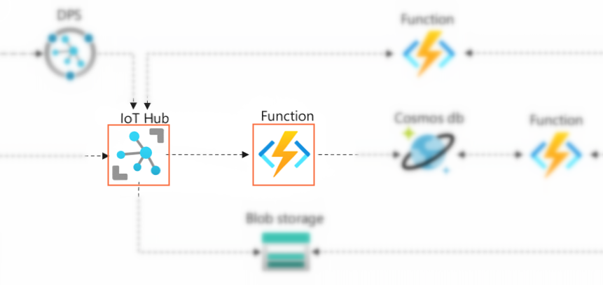

# 实验3：编写Function实现数据解析

## 🎯实验目的

本节实验你将学习到Azure Function App基础知识。自己动手在Azure Portal上使用javascript语言编写一个Function，处理蜂窝网关并上传到IoT Hub的原始数据，再根据CAN协议解析成可读的格式。同时获取device id为后面存储到数据库作准备。



## 📑基础阅读

### ❔Serverless无服务架构

在云原生架构设计演进的过程上，事件驱动和函数既应用（FaaS，Function As a Service）的编程模式是一个热门的方向和分支，也可以称为Serverless无服务架构。这种模式充分利用现代容器技术和云平台提供的能力，让开发者只需关注核心业务逻辑的实现，省去基础设施和高可用等复杂又无法为业务增值的工作，同按需分配和使用云资源的运行方式，可以在有效降低成本的同时还能获得很好的弹性。无服务设计模式是平台既应用（PaaS，Platform As a Service）的最佳伙伴，通过平台提供的各种触发器和内置的连接能力，用户仅在他们关心的事件和数据产生的时刻才介入，编写一个无状态、单一功能的函数，实现具体的业务逻辑。

> 💡无服务设计模式也不是所有场景都有优势，对于需要长时间运行的逻辑代码、依赖于内部状态进行处理的应用，以及冷启动有极短需求的情况，使用传统的长时间运行的计算服务可能更合适。

> 💡PaaS + FaaS的设计模式很适合专注于实现业务增值的IoT开发者。他们的技术背景可能偏硬件和嵌入式系统设计，而非IT或者云计算领域，使用这样的搭配可以快速实现满足功能需求，又能满足规模化部署的性能要求。

### ❔什么是Function App

Azure Function App是在上Azure上实现无服务架构的核心服务，它与Azure其他服务紧密集成，通常作为下游处理引擎处理具体的业务，比如Web API后端实现，文件上传后的处理，响应数据库更改，计划任务定时运行和IoT hub数据流转换等场景都可以使用Function App来完成。

Function App Runtime支持在Windows或者Linux操作系统，用户可以使用C#、Java、JavaScript、Python和PowerShell编写自己的代码，甚至通过custom handler使用其他不被原生支持的语言，比如Go和Rust。

Function App支持在Portal上直接开发，也提供完整的、基于vscode的扩展工具让用户在本地进行代码的开发和测试，借助这些工具，编写和调试Function跟传统的软件开发体验几乎没有区别。用户只要点击一个按钮，就可以同步&部署本地代码到Azure云端。

> 💡本实验为了减少因不同软件环境和网络访问引入的问题，选择直接在Portal上进行开发。但是在实际的应用中，绝大部分用户都将使用工具和扩展在本地进行开发。

### ❔Function App的文件结构

不同语言的Function的组成结构略有不同，本实验将使用javascript/node.js进行开发，这里的示例仅针对javascript/node.js的情况：

```
- yourfuncitionapp    
  - yourfunction1       // 与yourfunction1同名的文件夹
    - index.js          // 默认Function入口代码文件
    - function.json     // 当前Function配置文件，定义此Function的Trigger和Binding
  - yourfunction2     
    - index.js        
    - function.json   
  - node_modules        // 整个FunctionApp共享的node模块
  - host.json           // 整个FunctionApp的配置文件，包括日志、Extension bundles相关的配置
  - package.json        // node.js项目文件
  - local.settings.json // 本地存储connection string和环境变量的文件，避免代码直接嵌入这些信息
```

> 💡在Azure环境的Function App使用**Applciation Setting**来存储环境变量和敏感信息（等同于本地的local.settings.json文件），用户也可以使用Azure Key Vault来管理这些secret。

### ❔什么是Trigger和Binding

Trigger即触发器，这个容易理解，它用声明的方式描述了一个Function是因为一些什么样的事件发生而被系统调用。每个Function有且只有一个Trigger，Trigger通常也会带有数据作为参数传递给函数。

Binding稍微难理解一点，它同样是使用声明的方式描述了Function与其他Azure服务之间数据输入和输出的关系。Binding分为Input binding和Output binding。

- Input binding为Function提供数据。比如Azure Blob Storage支持Input binding，binding会帮用户把文件从blob中取出来作为参数传递进Function，省去了在Function中使用SDK或者REST API去读取的麻烦。

- Output binding将Function中的数据传入到其他服务。比如往数据库写入一条record，用户不需要在Function内部集成odbc和写SQL语句，直接通过特定参数或者return返回值，由binding来帮助完成实际的写入步骤。

Trigger和Binding的声明写每个Function文件夹下的function.json中，下面示例是一个接下来实验中Portal自动创建的Function.js，它定义了一个IoT hub trigger，其中一些重要字段的解释如下：

```json
{
    "bindings": [{
        "type": "eventHubTrigger",
        "name": "IoTHubMessages",
        "direction": "in",             
        "eventHubName": "iot-lab-hub-<your-name>",   
        "connection": "iot-lab-hub-<your-name>_events_IOTHUB",
        "cardinality": "many",
        "consumerGroup": "$Default",
    }]
}
```

|字段|含义|
|---|---|
|**type**|字符串表示该Trigger或者Binding的类型，具体支持哪些类型可以参考这个[表格](https://docs.microsoft.com/en-us/azure/azure-functions/functions-triggers-bindings?tabs=csharp#supported-bindings)|
|**name**|字符串表示变量名，将作为参数传入Function，当存在多个Binding时，按照他们声明的顺序传递|
|**direction**|Trigger和Input binding是**in**，Output binding是**out**|
|**connection**|字符串是该Binding连接服务的connection string变量名，它的值存储在applciation settings中|
|**cardinality**|一个IoT hub/Event hub Trigger特有的字段，`many`表示一次触发可以是包含了多条数据，此时IoTHubMessages参数是一个Array类型，每个元素都是一个JSON字符串，`one`表示一次触发只包喊一条数据，此时IoTHubMessages是一个被parse后的对象|
|**consumerGroup**|一个IoT hub/Event hub Trigger特有的字段，告诉Binding从哪一个消费组中读取消息，消费组可以在[IoT Hub endpoint](https://docs.microsoft.com/en-us/azure/iot-hub/iot-hub-devguide-messages-read-builtin)页面配置|


## 🧪实验步骤

### 1）创建Function App

1. Azure Portal左侧导航栏选择**Create a resource**，在**Computer**分类中选择**Function App**点击**Create**开启创建向导

2. **Subscription**和**Resource group**分别选择实验订阅和新建的资源组

3. **Function App name**输入一个独立无二的的名称，比如`iot-lab-function-app-<your-name>`，它会成为Function App URL的前缀：`iot-lab-function-app-<your-name>.azurewebsites.net`

4. **Publish**选择`Code`

5. **Runtime Stack**选择`Node.js`

6. **Version**选择默认的`16 LTS`

6. **Region**选择`East Asia`

7. **Operating System**选择`Windows`

8. **Plan Type**选择`Consumption(Serverless)`

5. 点击**Review + Create**->**Create**创建Function App服务

### 2）创建并执行IoT hub Trigger Function

Function App binding支持IoT hub作为Trigger，用户可以非常方便的使用Azure Function作为IoT hub下游的数据处理引擎。在这一步中你将使用IoT hub trigger 实现触发Function调用并从内置Event hub endpoint中读取原始数据作处理和展示。

1. 进入Function App服务，左侧导航栏选择**Functions**，点击**Create**

2. 在打开的窗口中，选择`Develop in Portal`，**Template**选择`IoT Hub(Event Hub)`

3. **New Function**输入一个function名称，比如`func_iothub`

4. **事件中心连接**处点击**New**，点击**IoT Hub**分类选择上一个实验创建的IoT Hub实例，下面选择`Events(built-in endpoint)`，点击**OK**

5. **Consumer group**保持默认的`$Default`

6. Function创建完成后在左侧**Developer**导航栏中点击**Code + Test**后可以看到Function的源码文件**index.js**和**function.json**，默认的代码只是把收到的消息记录到Application Insight日志中，下面是代码的基本结构和注释：

    ```javascript
    // Javascript Function使用module.exports声明入口
    // context参数总是作为第一个参数
    // IoTHubMessages是按照function.json中binding的配置和顺序来命名的
    module.exports = function (context, IoTHubMessages) {
        
        //记录日志到Appliation Insight
        context.log(`JavaScript eventhub trigger function called for message array: ${IoTHubMessages}`);
        
        // 当Function配置支持多个消息打包为一条消息触发时，IoTHubMessages是一个[]数组对象
        // forEach接收一个回调函数，message => {}是匿名箭头函数内联写法，表示该函数拥有一个message参数
        IoTHubMessages.forEach(message => {
            context.log(`Processed message: ${message}`);
        });

        // 在Function v1.x runtime中指示函数结束
        context.done();
    };
    ```

6. 在左侧**Developer**导航栏中点击**Monitor**，在展开的页面**Invocation**可以看到Function被调用的记录和成功与否的状态。选择**Logs**，可以Applicaiton Insight中的日志，代表Function已经被正常触发和执行

    ```
    2022-05-28T07:18:15.418 [Information] Executing 'Functions.IoTHub_EventHub1' (Reason='(null)', Id=0cc6c415-3237-4a8b-b1b4-e9bcf835c0d6)
    2022-05-28T07:18:15.418 [Information] Trigger Details: PartionId: 2, Offset: 259968-259968, EnqueueTimeUtc: 2022-05-28T07:18:15.4000000Z-2022-05-28T07:18:15.4000000Z, SequenceNumber: 447-447, Count: 1
    2022-05-28T07:18:15.423 [Information] Processed message: {"common":{"tsp":[0,22,5,28,15,18,14],"did":"89860476262091398282","gnss":{"vld":false,"lon":0,"lat":0,"alt":0,"sat":0,"hdop":0}},"type":"cycCan","payload":{"c1":"0103040b821dff00"}}
    2022-05-28T07:18:15.423 [Information] Executed 'Functions.IoTHub_EventHub1' (Succeeded, Id=0cc6c415-3237-4a8b-b1b4-e9bcf835c0d6, Duration=6ms)
    ```

### 3）提取和解析温湿度数据

蜂窝网关会产生包含**cycDev**和**cycCAN**两种类型的消息，这里关心的是**cycCan**的消息，它的**payload**中会按照device twin配置的CAN ID采集并返回原始数据，下面是消息的范例格式。

```json
{
    "common": {
        "gnss": { "lon": 24.12, "lat": 212.00 }
    },
    "type": "cycCan",
    "payload": {
        "c1": "01030400a670e5800",
        "c2": "..."
    }
}
```

在本实验中，c1的值为温湿度传感器原始数据，这个字符串的各个字符的含义如下：

|字符索引|0-1|2-3|4-5|6-9|10-13|14-15| 
|---|---|---|---|---|---|---|
|示例|01|03|04|0A67|0E58|00|
|含义|帧ID|功能码|数据长度|温度 x 100|湿度 x 100|保留

本节重新编写Function的代码，根据协议解析转换原始数据为浮点数据。把下面代码复制粘贴到**index.js**中点击**Save**，界面下方自动显示log日志窗口，稍等片刻观察结果。

```javascript
// Function v2.x后的runtime推荐使用async函数，且无需在结束的位置调用context.done()
module.exports = async function (context, IoTHubMessages) {

    IoTHubMessages.forEach(message => {
        // message是一个字符串，先转换为JSON方便处理
        const parsed = JSON.parse(message);
        if (parsed.type === 'cycCan') {
            // substring返回一个范围为[indexStart, indexEnd)字符串
            const temperature = Number('0x' + parsed.payload.c1.substring(6, 10)) / 100;
            const humidity = Number('0x' + parsed.payload.c1.substring(10, 14)) / 100;

            context.log(`Temperature = ${temperature}, Humidity = ${humidity}`);
        }
    });

    // Function v2.x后的runtime使用async函数，无需在结束的位置调用context.done()
};
```

正常执行可看到如下日志：

```
2022-05-28T06:53:13.080 [Information] Executing 'Functions.IoTHub_EventHub1' (Reason='(null)', Id=d35c9e79-3d69-4c5e-a755-62c0a651a053)
2022-05-28T06:53:13.080 [Information] Trigger Details: PartionId: 2, Offset: 230768-230768, EnqueueTimeUtc: 2022-05-28T06:53:13.0560000Z-2022-05-28T06:53:13.0560000Z, SequenceNumber: 397-397, Count: 1
2022-05-28T06:53:13.083 [Information] Temperature = 29.26, Humidity = 77.39
2022-05-28T06:53:13.084 [Information] Executed 'Functions.IoTHub_EventHub1' (Succeeded, Id=d35c9e79-3d69-4c5e-a755-62c0a651a053, Duration=3ms)
```

### 4）从Function获取metadata

从Function参数传入的**IoTHubMessages**只包含了Telemetry消息的内容，不包括properties，enqueuedtime等metadata数据。Azure Function javascript规范规定了这些信息通过**context.bindingData**传递，具体不同服务的binding的数据不同。

尝试使用下面代码，显示每条消息中的device id。

```javascript
module.exports = async function (context, IoTHubMessages) {
    IoTHubMessages.forEach((message, index) => {
        const deviceid = context.bindingData.systemPropertiesArray[index]['iothub-connection-device-id'];
        context.log(`Message ${index} is from ${deviceid}`)
    })
};
```

正常执行可看到如下日志：

```
2022-05-28T06:56:14.606 [Information] Executing 'Functions.IoTHub_EventHub1' (Reason='(null)', Id=85a6f65a-03e6-40c7-b29a-7c4ac33469c9)
2022-05-28T06:56:14.607 [Information] Trigger Details: PartionId: 2, Offset: 234272-234272, EnqueueTimeUtc: 2022-05-28T06:56:14.5840000Z-2022-05-28T06:56:14.5840000Z, SequenceNumber: 403-403, Count: 1
2022-05-28T06:56:14.610 [Information] Message 0 is from n210001
2022-05-28T06:56:14.611 [Information] Executed 'Functions.IoTHub_EventHub1' (Succeeded, Id=85a6f65a-03e6-40c7-b29a-7c4ac33469c9, Duration=5ms)
```

## 📚扩展阅读

- 🔗[Azure Function Overview](https://docs.microsoft.com/en-us/azure/azure-functions/functions-overview)

- 🔗[Azure Functions triggers and bindings concepts](https://docs.microsoft.com/en-us/azure/azure-functions/functions-triggers-bindings?tabs=csharp)

- 🔗[Azure IoT Hub trigger for Azure Functions](https://docs.microsoft.com/en-us/azure/azure-functions/functions-bindings-event-iot-trigger?tabs=in-process%2Cfunctionsv2%2Cextensionv5&pivots=programming-language-javascript)

- 🔗[Azure Functions JavaScript developer guide](https://docs.microsoft.com/en-us/azure/azure-functions/functions-reference-node?tabs=v2-v3-v4-export%2Cv2-v3-v4-done%2Cv2%2Cv2-log-custom-telemetry%2Cv2-accessing-request-and-response%2Cwindows-setting-the-node-version)