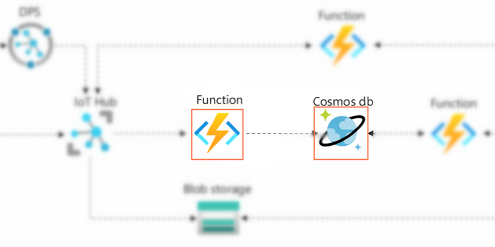

# 实验4：存储时序数据到Cosmos DB

## 🎯实验目的

本节实验你将学习到Azure Cosmos DB的基础概念，从IoT应用的数据特点开始，分析并理解为什么Cosmos DB是IoT场景下的hot path数据库的优选方案。在动手实验中，你将使用Function App的Cosmos DB Output binding把上一节实验中蜂窝网关获取的遥测数据写入到Cosmos DB数据库，并使用Portal上的Data Explorer查询数据。



## 📑基础阅读

### ❔NoSQL数据库

NoSQL的解释为**Not Only SQL database**，泛指不同于传统关系型的数据库的数据库，主要类型包括文档、KV键值、列和图形数据库四大类，它们提供了更加贴近应用特点的方式存储和访问数据，通常可以比SQL数据库更加灵活，也更容易横向扩展。NoSQL数据库对于数据的格式和他们之间的关系相比SQL数据库要宽松得多，使用JSON/BSON等半结构化的形式记录，更有利于数据模型伴随应用的需求作出改变，而SQL数据库在设计之处就要考虑到所有数据之间的关联，它可以更好的保证数据的完整性但是要重构数据模型相对困难。在现代Web应用中，NoSQL已经非常流行。同时，NoSQL数据库也非常适合IoT的场景。

### ❔IoT应用数据的特点

IoT典型应用的数据类型包括遥测数据，报警事件，设备的metadata等等，这些数据可以很方便的用JSON这样的文档格式描述，也非常适合使用NoSQL数据库来管理IoT数据。其中最关键几个特证：

1. IoT设备种类和数据源丰富多样，数据格式和关系很难在应用设计之处就完全敲定

2. IoT场景中最重要的Telemetry遥测数据是一种写操作频繁且很少需要修改的数据类型

3. IoT遥测数据是弱关联的，通常它已经嵌入了所有的信息，很少需要关联其他数据项

4. IoT遥测数据通常有批量聚合和处理的需求，时间轴可能跨度很大，数据量庞大

5. IoT设备可能从全球不同地区接入进行大量的数据的写入，对于数据的延迟和同步有较为苛刻的要求

从以上这些特证可以看出在IoT场景中很适合采用文档型NoSQL数据库进行建模。

💡实际上，根据不同类型数据的时效和成本要求，只使用一种类型数据存储方案也很难满足要求，在IoT架构规划中通常也会考虑冷、热、温等不同的数据路径的设计，需要将块存储、文件存储、SQL/NoSQL和数据仓库服务搭配使用。

### ❔Azure Cosmos Database基础知识

Azure Cosmos DB是一个全托管的全球分布式多模型NoSQL数据库，它是微软Azure上NoSQL数据库的终极解决方案。Cosmos DB拥有99.999%的超高可靠性设计和性能保证的毫秒级延迟，它还拥有极强的弹性，能够横向扩容支持任意规模的应用。

为什么说Cosmos DB是NoSQL终极解决方案？前面不是才说了NoSQL分为四大类吗？没搞错，不管是文档型，键值型，列数据库或者图数据库，Cosmos DB全都支持！基于同一个内核，Cosmos DB支持五种API：

- SQL(Core) API: 适用性最广泛的文档型数据库，使用SQL查询语言

- API for MongoDB: 兼容MongoDB文档型数据库

- Cassandra API: 兼容Apache Cassandra列式数据库

- Gremlin API: 兼容Apache TinkerPop图数据库的Gremlin查询语言接口

- Table API: 兼容Azure Table Storage的KV键值操作源语

其中Azure Cosmos DB SQL(Core) API是Azure Cosmos DB的原生接口，其他API都是通过转接协议实现兼容的接口。使用这些API可以最大限度复用开发者已经掌握的知识、工具和代码，同时又能享受到Cosmos DB的卓越的性能和高靠性。不过，当你的应用是从头开始编写，没有特别理由要兼容其他NoSQL数据库API时，使用SQL(Core) API才是最正确的选择。而在本实验中我们更是只用到Cosmos DB非常非常小的一部分能力，因此后面部分只聚焦在SQL(Core) API相关的概念和使用。

SQL API，顾名思义，可以使用SQL作为查询语言，不需要掌握任何新的查询语言和SDK，直接可以利用NoSQL数据库的特性，这点极大的方便了传统SQL数据库的开发者，降低了学习成本。

另外我们需要知道的是Azure Cosmos DB是如何组织资源的，

```
- account               // 每个account只支持一种API，可以支持无限容量和性能
  - database            // 只是一个namespace
    - container         // 实际的可伸缩的单元，实现逻辑分区管理数据
      - item1           // 单个JSON格式的文档，支持创建，更新，读取，删除等操作
      ...
      - itemN
```

在本实验中，你将建立一个自己的Container, 存储设备发送的telemetry遥测数据，每一条遥测数据保存为一个JSON文档(item)存储。在实际的应用中，你也可以使用bucket模式来管理批量的遥测数据，把遥测数据要按照一定规则（时间、设备、归属等）插入到同一个文档的中，这样设计可以有效提高相关遥测数据聚合时候的性能。

### ❔关于Partition Key

一个Container中的item可以有完全不同的数据表示，只有一个字段需要关心就是选择（谁是）**Partition Key**。它决定了一个Container中逻辑分区的数量（Cosmos DB自己管理物理分区，完全不需要用户关心），最终会影响到查询性能和负载均衡。一般的原则是选择取值范围大又均匀分布的字段作为Partition Key。

在IoT的场景中，`device Id`通常是一个非常好的选择。由于Cosmos DB把Partition Key相同的item存放在同一个逻辑分区中的，当使用device id作为Partition Key的时候，相同设备的数据都是存放在一起的，而在往往后面实际业务查询的时候很多情况会把将device id作为WHERE语句的过滤条件，这样大大提高了查询的效率。

> 💡一个逻辑分区最多只能存储20GB的数据，如果使用device id作为Partition Key，则同一个device Id的数据总和不可以超过20GB，如果这个数字有可能被超过，就需要考虑使用取值条件更广的键，或创建一个者复合字段，比如`device id + 日期`来作为Partition Key。

## 🧪实验步骤

### 1）创建Cosmos DB SQL API账户

1. Azure Portal左侧导航栏选择**Create a resource**，在**Database**分类中选择**Azure Cosmos DB**点击**Create**开启创建向导

2. 选择`Core (SQL) - Recommended`，点击**Create**

2. **Subscription**和**Resource group**分别选择实验订阅和资源组

4. **Account name**输入一个独一无二的名称，比如`iot-lab-cosmosdb-<your-name>`，它会成为Cosmos DB Account URL的前缀：`iot-lab-cosmosdb-<your-name>.documents.azure.com`

5. **Location**选择`East Asia`

5. **Capacity mode**选择`Serverless`

6. 点击**Review + Create**->**Create**创建Cosmos DB SQL API Account

### 2）创建Cosmos DB Container

1. 进入Cosmos DB Account，左侧导航栏选择**Data Explorer**，在Explorer窗口中点击**New Container**

2. **Database id**选择**Create New**，输入一个名称，如`mydatabase`

3. 同样**Container id**输入一个名称，如`mycontainer`

4. **Partition Key**输入`/deviceid`，点击**OK**创建Container

### 3）增加Cosmos DB Output binding

Function App的binding功能支持Cosmos DB Trigger/Input/Output，大大简化了开发者的Function代码。在这一步中将使用Cosmos DB Output binding实现将温湿度和deviceid写入数据库。

1. 回到上一步创建的Function中，在左侧导航栏选择**Integration**

2. **Outputs**点击**Add Output**

3. **Binding Type**选择`Azure Cosmos DB`

4. **Cosmos DB account connection**点击**New**，在窗口中选择刚刚创建的Cosmos DB Account，点击**OK**新建一个连接

5. **document parameter name** 保持`outputDocument`

6. **database name**和**Collection Name**分别输入上一步创建的`mydatabase`和`mycontainer`，点击**OK**创建binding

> 💡在Portal上配置binding实质上是通过GUI编写function.json文件，进入**Code+Test**页面选择function.json源码文件，可以看到上一个实验中用向导新建的IoT hub trigger和本实验创建Cosmos DB Output binding的详细配置：

```json
{
    "bindings": [{
        "type": "cosmosDB",
        "name": "outputDocument",
        "direction": "out",
        "connectionStringSetting": "iot-lab-cosmosdb-<your-name>_DOCUMENTDB",
        "databaseName": "mydatabase",
        "collectionName": "mycontainer"
    }]
}
```

每个Binding的配置字段意义有相似之处也有独特的一些配置：

|字段|含义|
|---|---|
|**name**|字符串表示变量名，在这里将成为context.bindings下面一个变量，用作传递数据给Binding |
|**connectionStringSetting**|字符串是Cosmos DB Binding连接服务的connection string变量名，它的值存储在applciation settings中|
|**databaseName**|一个Cosmos DB Binding特有的字段，指明操作哪个database|
|**collectionName**|一个Cosmos DB Binding特有的字段，指明操作哪个container|

### 3）写遥测数据到Cosmos DB

有了上一个实验中获取温湿度值和device id的代码段，再加上一个进入IoT hub的时间戳的metadata数据，我们只要把这些数据打包成JSON格式的item，通过Binding声明的变量**outputDocument**传递出去即可。

复制下面代码到Function中保存，观察Application Insight日志记录

```javascript
module.exports = async function (context, IoTHubMessages) {
    // 声明一个items数组，把一次Function调用所有的数据都写进去
    const items = [];
    IoTHubMessages.forEach((message, index) => {
        const parsed = JSON.parse(message);
        if (parsed.type === 'cycCan') {
            const temperature = Number('0x' + parsed.payload.c1.substring(6, 10)) / 100;
            const humidity = Number('0x' + parsed.payload.c1.substring(10, 14)) / 100;
            const deviceid = context.bindingData.systemPropertiesArray[index]["iothub-connection-device-id"];
            const arrived = context.bindingData.systemPropertiesArray[index]["iothub-enqueuedtime"];
            // 按照定义的schema构造对象
            const item = {
                deviceid: deviceid,
                arrived: arrived,
                temperature: temperature,
                humidity: humidity
            }
            context.log(item);
            // 把解析到的遥测数据插入到items数组
            items.push(item);
        }
    });
    // 通过Cosmos DB binding声明的outputDocument变量传递内容
    if (items.length != 0) {
        context.bindings.outputDocument = JSON.stringify(items);
    }
};
```

### 4）运行查看Cosmos DB

等待几分钟后进入Cosmos DB查看数据，可以通过SQL语句查询数据，比如一段时间温度传感器的平均值。

1. 进入Cosmos DB Account，左侧导航栏选择**Data Explorer**，在Explorer窗口找到建立好的**database/container/items**目录，默认会运行一条**SELECT * FROM c**的语句列出所有的item，点击任意的item可以查看JSON文档的内容，

    ```
    {
        "deviceid": "a22210001",
        "arrived": "2022-06-02T09:08:09.318Z",
        "temperature": 28.79,
        "humidity": 82.92,
        "id": "fc871121-199d-444f-8d97-77a21cc00924",
        "_rid": "YKI9ANj-mBMBAAAAAAAAAA==",
        "_self": "dbs/YKI9AA==/colls/YKI9ANj-mBM=/docs/YKI9ANj-mBMBAAAAAAAAAA==/",
        "_etag": "\"fa05a828-0000-1900-0000-62987e530000\"",
        "_attachments": "attachments/",
        "_ts": 1654160979
    }
    ```

    > 💡从**id**开始往下的都是系统自动添加的字段，比如_ts是存入Cosmos DB的时间，_etag用作并发控制目的，他们都是由Cosmos DB服务端维护并更新的。

2. 在Data Expolrer中点击**Edit Filter**按钮展开SQL语句WHERE子句部分编辑窗口，尝试的一些下面SQL语句查询一段时间内的遥测数据文档

    ```sql
    SELECT * FROM c WHERE c.deviceid = "<your-deviceid>" AND (c.arrived between "<start-time>" AND "<end-time>")
    ```

    > 💡以上分别是查询Cosmos DB的两种数据读取方式，通过REST API单点读和SQL查询批量读取，他们的应用场景不同，消耗资源也是不同的，大多数的应用会结合两者进行，以平衡成本和效能。

## 📚扩展阅读

- 🔗[Welcome to Azure Cosmos DB](https://docs.microsoft.com/en-us/azure/cosmos-db/introduction)

- 🔗[Azure Cosmos DB in IoT workloads](https://docs.microsoft.com/en-us/azure/architecture/solution-ideas/articles/iot-using-cosmos-db)

- 🔗[Azure Cosmos DB trigger and bindings](https://docs.microsoft.com/en-us/azure/azure-functions/functions-bindings-cosmosdb-v2?tabs=in-process%2Cfunctionsv2&pivots=programming-language-javascript)

- 🔗[Getting started with SQL queries](https://docs.microsoft.com/en-us/azure/cosmos-db/sql/sql-query-getting-started)