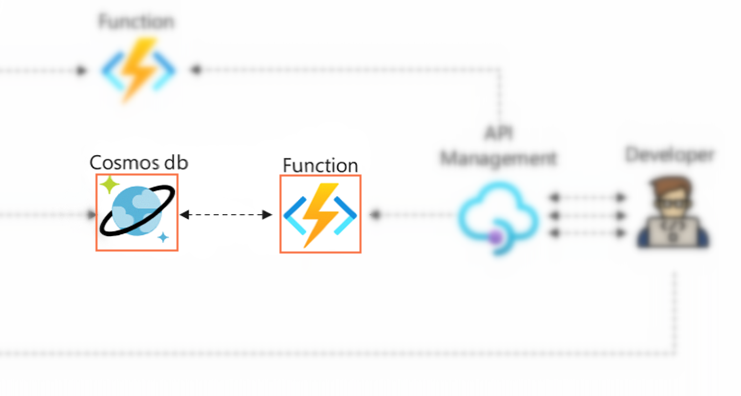

# 实验5：使用HTTP(S)查询Cosmos DB

## 🎯实验目的

本节实验继续Azure Function App和Azure Cosmos DB的学习和实践。用户将使用Function App响应HTTP请求从Cosmos DB中返回指定device的最近5条温湿度数据。通过学习本节内容，用户可以掌握到HTTP Trigger, HTTP Output binding和Cosmos DB Input binding的基本用法。



## 🧪实验步骤

### 1）创建并测试HTTP Trigger Function

Function App binding支持HTTP Request作为Trigger触发Function执行，并通过Output binding提供HTTP response。这是Serverless架构中非常重要的一个功能，多个Function可以组成起来作为API驱动的无服务后端。这一步从学习一个最简单的HTTP Trigger实例代码开始，了解HTTP Trigger Function的使用和配置。

1. 进入Function App服务，左侧导航栏选择**Functions**，点击**Create**

2. 在打开的窗口中，选择`Develop in Portal`，**Template**选择`HTTP Trigger`

3. **New Function**输入一个该Function App中独立无二的的名称，比如`func_http`

4. **身份验证级别**处选择`Anonymous`，点击**Create**创建Function

5. 进入创建的Function，点击**Code + Test**后可以看到Function的源码文件**index.js**和**function.json**，默认的代码将HTTP request中的name query参数的值填到HTTP responsed的body返回。下面是代码的基本结构和注释：

    ```javascript
    module.exports = async function (context, req) {
        context.log('JavaScript HTTP trigger function processed a request.');

        // req参数在function.json中声明，传递HTTP Request相关信息，包括route路径, query参数和body等
        const name = (req.query.name || (req.body && req.body.name));
        const responseMessage = name
            ? "Hello, " + name + ". This HTTP triggered function executed successfully."
            : "This HTTP triggered function executed successfully. Pass a name in the query string or in the request body for a personalized response.";

        // context.res在function.json中声明，用于提供HTTP响应结果
        context.res = {
            // status: 200, /* Defaults to 200 */
            body: responseMessage
        };
    }
    ```

6. 点击**Get Function URL**，在打开的窗口中，Key选择**Default**，点击**文件图标**复制Function URL

    ```
    https://iot-lab-function-app-<your-name>.azurewebsites.net/api/<func-name>
    ```

7. 打开浏览器粘贴URL，在URL后增加Query参数`?name=<your-name>`，访问网址可以从浏览器窗口可以看到回复的文本: `Hello, <your-name>. This HTTP triggered function executed successfully.`

    > 💡服务端身份验证与链路加密：默认配置下Function App仅接受HTTPS访问，所有HTTP请求将被重定向到HTTPS端口上。同时，Function App强制使用TLS 1.2协议加密链路。

    > 💡HTTP Trigger Function的授权与认证：Function支持function, host, master等不同级别的Key认证方式，这里实验选择**Anonymous**可以方便测试。并且在后面与API management结合的实验中，可以直接使用在API management服务的安全机制进行授权与认证。

### 2）修改route路径和支持的HTTP方法

由向导默认创建的URL是`/api/<func-name>`，用户也可以在Binding中自己修改路由路径。这一步中尝试自定义一个支持模板的URL规则`/api/{device}/telemetry`，为后面实验做好准备。

1. 在左侧导航栏选择**Integration**

2. 在展开的页面中，**Trigger**里选择`HTTP(req)`，打开刚刚创建的HTTP Trigger的GUI配置

3. 在**Route template**处修改为`{device}/telemetry`

4. 在**Selected HTTP method**处修改为仅支持`GET`方法，点击**Save**保存

5. 完成这一步后访问的URL已经改变，用户可以重复上一步复制URL粘贴到浏览器测试，U模板中的`{device}`可以用任意字符串替代。

### 3）增加Cosmos DB Input binding

Cosmos DB Input binding使用一种声明的方式从Cosmos DB中读取数据并传递给Function，其中最主要工作就是编写binding配置文件：

1. 回到上一步创建的Function中，在左侧导航栏选择**Integration**

2. **Input**点击**Add Input**

3. **Binding Type**选择`Azure Cosmos DB`

4. **Cosmos DB account connection**选择上一实验中已创建的Application Setting

5. **document parameter name** 保持`inputDocument`

6. **database name**和**Collection Name**分别输入之前创建的`mydatabase`和`mycontainer`

7. **Document id**和**Partition key**保持为空，**SQL Query**输入下面查询语句，点击**OK**创建binding

```
SELECT TOP 5 c.temperature, c.humidity FROM c WHERE c.deviceid = {device} ORDER BY c.arrived DESC
```

> 💡此SQL语句从指定的container中的指定device筛选出最近的五条温湿度数据，其中{device}取值上一步中的HTTP Trigger route路径，比如`GET /api/device001/telemetry`，{device}被替换为`"device001"`。

8. 下面是向导自动创建的Function.json，它各字段的含义与上一实验中介绍的Cosmos DB Output binding是一样的，**sqlQuery**中保存了要运行SQL语句的模板。

    ```json
    {
        "type": "cosmosDB",
        "name": "inputDocument",
        "direction": "in",
        "connectionStringSetting": "iot-lab-cosmosdb-<your-name>_DOCUMENTDB",
        "databaseName": "mydatabase",
        "collectionName": "mycontainer",
        "sqlQuery": "SELECT TOP 5 c.temperature, c.humidity FROM c WHERE c.deviceid = {device} ORDER BY c.arrived DESC",
    }
    ```

### 4）编写和测试Function代码

回顾一下目标：实现一个HTTP请求从Cosmos DB中读取某个设备最近的5条温湿度数据，这个代码到底有多简单呢？看看下代码：

```javascript
module.exports = async function (context, req, inputDocument) {
    context.res = {
        status: 200,
        // inputDocument是在Cosmos DB Input binding中声明的变量名，SQL语句查询到结果会通过它传递给Function
        body: JSON.stringify(inputDocument)
    };
};
```

最后运行并测试这个HTTP请求的功能：

1. 选择**index.js**文件，复制粘贴上面代码，点**Save**保存。

2. 点击**Get Function URL**，在打开的窗口中，Key选择**Default**，点击**文件图标**复制Function URL。

    ```
    https://iot-lab-function-app-<your-name>.azurewebsites.net/api/{device}/telemetry
    ```

3. 打开浏览器粘贴URL，将最后route参数修改为自己的deviceid，输入回车。从浏览器窗口可以看到这个设备最近的温湿度数据。

    ```json
    [
        {"temperature":29.09,"humidity":81.22}, 
        {"temperature":29.08,"humidity":81.33},
        {"temperature":29.05,"humidity":81.29},
        {"temperature":29.05,"humidity":81.28},
        {"temperature":29.06,"humidity":81.24}
    ]
    ```

## 📚扩展阅读

- 🔗[Azure Functions HTTP triggers and bindings overview](https://docs.microsoft.com/en-us/azure/azure-functions/functions-bindings-http-webhook?tabs=in-process%2Cfunctionsv2&pivots=programming-language-javascript)

- 🔗[Azure Functions binding expression patterns](https://docs.microsoft.com/en-us/azure/azure-functions/functions-bindings-expressions-patterns)

- 🔗[Securing Azure Functions](https://docs.microsoft.com/en-us/azure/azure-functions/security-concepts?tabs=v4)