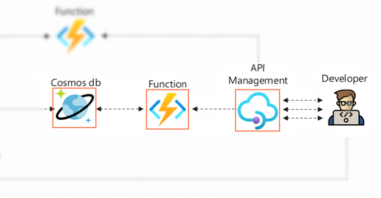

# 实验6：使用API Management托管API

## 🎯实验目的

通过前面的实验已经实现了一个IoT数据采集、预处理、存储以及获取的最小系统。理论上只要继续完善其他数据类型，继续添加更多的HTTP Function，比如获取车辆信息，获取货运行程信息等，便可以实现规划的冷链运输车辆状态与运输环境监测系统。但是，别忘了本实验的终极目标是输出一套完整的API供其他业务系统使用。如何能够统一的设计、规范化、发布和版本化这些API，甚至提供的文档给使用最终API的使用者？答案就是使用专门的API管理服务，也称为API网关。

本节实验学习的目标就是在Azure上的API网关PaaS服务：Azure API Management。你将创建一个服务实例，把之前实验中实现的温湿度数据获取API使用API Management托管并进行测试。



## 📑基础阅读

### ❔欢迎来到API为先的世界

如果有人问我数字世界是由什么组成的，那么我的答案一定是硅和API。芯片是所有数字的计算的基石，而API则是所有业务系统交互的粘合剂。有句话叫“API正在吞噬世界”，说明了它的无处不在。而其背后的原因则跟软件开发领域在过去十年中发生的翻天覆地的变化息息相关：

1. 云计算成为主流，任何人无需购买和维护任何硬件，都可以使用最近先进的计算、网络和存储资源，设计出巨大规模的系统。

2. 开源软件也在吞噬我们的世界，有着数以百万计的开源代码库资源供你选择，几乎你可以想象到的任何一个通用功能，它任何一个语言的编程语言的实现，你都可以找的到现成的资源。

3. DevOps的兴起让软件的持续集成、自动化测试、软件开发运维的生命周期管理比以前高效得多。

今天系统和软件的复杂度已经远超人们的想像，消费者希望拥有最好的体验，7X24小时的服务，任何终端在任何地方都可以访问到一致的数据和业务。这些需求导致今天的应用不再是单体的，部署和运行在一台计算机或某一个数据中心的应用，取而代之是分布式的、多节点的复杂系统。面对这些挑战，**没有任何一家公司、团队或工程师可以自己从头构建每一个功能**，即使是强如Microsoft、Google这样的企业，也不行！任何人都也必须要协作起来，既要提供开放自己的能力，也要拥抱他人的能力，才能才竞争中不落于下风。这一切的一切都离不开我们的主角：API。

Public API的开发和集成的需求迫使所有人围绕API开始建设软件，企业和组织纷纷开始推进**API为先**的设计理念和开发模式，定义自己的API策略，构建自己的API管理工具和流程。API不再是某一个家企业自己的事情已经形成了产业、联盟和标准：大家对RESTful设计风格的认同、推崇使用OpenAPI的统一规范来定义和沟通API。

### ❔什么是Azure API Management

Azure API Management是Azure上混合多云的API管理平台，使用API Management可以很好的解耦API生命周期管理和API的后端服务，提供统一的入口服务私有数据中心和公有云上的应用，加强不同团队和角色之间学习API和沟通API的能力。

API Management服务由**API网关**、**管理平面**, 和**开发者门户**三大组件组成。所有的API请求先到达API网关，由网关按照Policy规则进行统一处理后再转发到相应的后端服务。API开发者可以使用管理平台提供的各种方法创建和导入API，支持设定各种的输入输出规则和安全配置，最后形成为文档和统计通过开发者门户提供给API的消费者和后台管理人员。

### ❔API Management Policy

Policy是API Management中的一个重要功能单元，它允许API的开发人员声明一些系列的动作，在HTTP request到达或HTTP response离开API网关的时候顺序的执行这些Policy定义的动作，支持的功能包括访问条件限制、身份验证、缓存、内容转换等等。Policy是一个XML配置文件，包含`inbound`、`backend`、`outbound`和`on-error`几个段落，分别代表不同阶段要执行的动作，用户可以通过编辑XML或者在Portal上表单进行Policy的定义和修改。Policy还支持使用C#表达式做一些复杂的处理和判断。关于Policy更详细的内容可以参照[这里](https://docs.microsoft.com/en-us/azure/api-management/api-management-policies)。

### ❔Contoso冷链运输车辆管理API


## 🧪实验步骤

### 1）创建API Management服务

1. Azure Portal左侧导航栏选择**Create a resource**，在**Integration**分类中选择**API Management**点击**Create**开启创建向导

2. **Subscription**和**Resource group**分别选择实验订阅和新建的资源组

3. **Region**选择`East Asia`

4. **Resource name**输入一个独一无二的名称，比如`iot-lab-api-<your-name>`，它会成为API Management URL的前缀：`iot-lab-api-<your-name>.azure-api.net`

5. **Organization name**输入任意名称

6. **Administrator email**输入一个有效的邮箱

7. **Pricing Tier**选择`Developer(No SLA)`

8. 点击**Review + Create**->**Create**创建API Management服务

### 2）从Function App导入并测试API

API Management的API创建和导入支持多种模式，这里使用最简单的从已有的Function App中导入上一步。

1. 进入API Management服务，左侧导航栏选择**APIs**，在分类**Create from Azure resource**中选择**Function App**

2. 在打开的窗口中，模式保持`Basic`，点击**Function App**处的**Browse**

3. 在打开的窗口中，点击**Select**，选择之前实验用到的Function App：`iot-lab-function-app-<yourname>`

4. 确认之前编写的读取Cosmos DB的Function是被选中的状态，点击**Select**

5. 回到**Create from Function App**向导界面，将**API URL suffix**改为**api**，点击**Create**开始导入

6. 在导入完成可以看到**All API**下出现了刚刚导入的API，**点击它**，右边有Portal控制平面的GUI窗口中有**Design**、**Settings**、**Test**、**Revision**、**Change log**几个选项卡，点击**Test**，在**Template parameters**处**device**的**VALUE**填写你需要查询设备的deviceid，最下面点击**Send**发送请求

7. 在**HTTP Request**可以看到发送的请求的URL，比如`GET https://iot-lab-api-<your-name>.azure-api.net/api/<your-device>/telemetry`，请求中包含了一个默认的、拥有当前API Management服务下所有API访问权限的**Subscription Key**，在**Test**功能页面中，Portal已经帮忙添加了这个Header，若是自己使用Postman等工具进行测试则需要手动添加

    > 💡API Management中的**Subscription**的概念与Azure层面的**Subscription**不是一回事，它定义了一组供API消费者使用的密钥，服务端通过验证密钥的正确性判断客户端是否已经被授权调用API，**Subscription**可以作用于全局、单个产品或单个API，它是API Management认证客户端权限的默认方式，其他认证方式还包括OAuth 2.0、客户端证书和指定IP地址等方式

8. 在**HTTP Response**/**Message**下可以看到API Management的API网关返回的结果

    ```
    HTTP/1.1 200 OK
    cache-control: private
    content-encoding: gzip
    content-type: text/plain; charset=utf-8
    date: Sun, 05 Jun 2022 14:52:30 GMT
    ocp-apim-apiid: func_http
    ...
    [{"temperature":29.09,"humidity":81.22},{"temperature":29.08,"humidity":81.33}, ...
    ```

### 3）增加调用限制Policy

继续选择该API，选择**Design**，可以看到有四个模块**Frontend**、**Inbound Processing**、**Outbound Processing**和**Backend**，用户可以使用Portal提供的GUI界面编辑API的规则和Policy。本节实验增加一个限制调用的规则，每30秒仅允许被调用3次，并测试效果。

1. 在**Inbound Processing**模块处点击**Add Policy**，选择**Limit Call Rate**

2. 在打开的配置界面中，**Number of calls**填`3`，**Renewal period (in seconds)**填`30`，其他保持不变点击**Save**保存

3. 返回后看到在Inbound Processing中增加了一个**rate-limit-by-key**的规则，点击`</>`标记可以看到Policy XML描述文件，其中`<inbound>`段落有三条Policy：

    ```xml
    <inbound>
        <base />
        <set-backend-service id="apim-generated-policy" backend-id="iot-lab-function-<your-name>" />
        <rate-limit-by-key calls="3" renewal-period="30" counter-key="@(context.Subscription?.Key ?? "anonymous")" />
    </inbound>
    ```

    > 💡`<base />`表示自动继承上一级Scope定义的Policy，Scope可以分为全局、产品、API和Operations四级。这里操作的是最底层的、最具体的Opeartion level，如果选择**All Operations**或者选择**All APIs**来设定Policy，则Policy的作用范围可以被下面具体的API或Operation继承。
    
4. 返回到**Test**选项下，填写deviceid续发送多次请求，第四次请求可以看到API网关返回**429 Too Many Requests**的状态码，说明API Management Policy已经生效

```
HTTP/1.1 429 Too Many Requests
...
{
    "statusCode": 429,
    "message": "Rate limit is exceeded. Try again in 21 seconds."
}
```

## 📚扩展阅读

- 🔗[API First world](https://api-first-world.com/)

- 🔗[About API Management](https://docs.microsoft.com/en-us/azure/api-management/api-management-key-concepts)

- 🔗[Azure API Design eBook](https://azure.microsoft.com/mediahandler/files/resourcefiles/api-design/Azure_API-Design_Guide_eBook.pdf)

- 🔗[OpenAPI Specification v3.1.0](https://spec.openapis.org/oas/v3.1.0#version-3-1-0)
