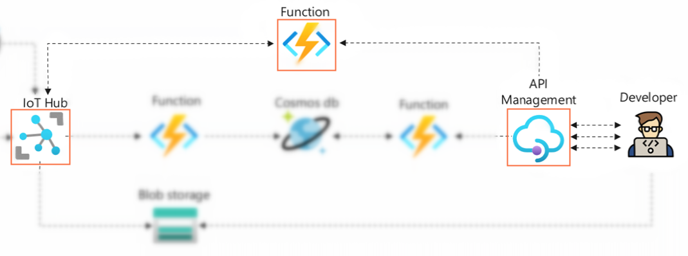

# 实验7：使用IoT SDK实现远程控制

## 🎯实验目的

本节实验你将实现一个REST API，控制蜂窝网关CAN总线上接入的I/O模块控制继电器和LED动作模拟远程锁车开锁的场景。通过本实验你可以学习IoT Hub控制设备的几种方法和IoT SDK的更新device twin的相关代码，同时了解如何在Azure Function中添加依赖模块调用（任意）SDK进行特定目的的开发。

蜂窝网关默认使用IoT Hub device twin的desired property同步设备I/O动作，并定义了twin协议格式：

```json
{ "desired": { "devconfig": { "Lock1": true  } } }
```



## 📑基础阅读

### ❔IoT Hub控制设备的方法比较

IoT Hub支持三种不同的方式实现云到设备的控制执行，分别是**1）发送C2D消息**，**2）通过Device Twin Desired property同步状态**和**3）执行Direct Method远程调用**。这些方法各有优缺点，理解他们的特点可以正确的选择在不同的场景下使用合适的方法。

1. **Direct Method**发送命令并**同步地**等待回应，适合需要设备立刻反馈执行结果的场景使用。比如读取设备实时状态、控制设备做一个具有时效性的动作，比如开灯。如果设备此时不在线，也能得到即时的反馈，知道命令执行失败了。它的另一个显著优点是**并发能力支持相对Device Twin和C2D更好**。在实际使用过程中，Direct Method一般是控制设备优先考虑的方法。

2. **Device Twin Desired Properties**通过Twin作为中间媒介通知操作设备进入某一种状态，不管设备此时是否在线，这个指令已经写入了Twin文档中，当设备上线后会收到通知，再进行状态的同步（通过reported proerty回报状态）。显而易见，Twin更适合长期和稳定状态的操作，比如通知设备有固件更新，设定温度计报警阈值等操作。

3. **Cloud To Device Message**消息支持云到设备的单向通讯，它支持消息缓冲，同时具有可编程的时效性，支持消息重传，比较适合设备在弱网环境下接收可靠的消息，但是C2D的缺点也比较明显，设备无法回传数据同时并发性能比较低。


## 🧪实验步骤

### 1）创建并测试HTTP Trigger Function

1. 在Portal上创建一个默认的HTTP Trigger Function，详细操作可以参照实验5中的[步骤](./lab5-cosmosdb-out.md###-1）创建并测试HTTP-Trigger-Function)

2. 修改Trigger binding的**Route template**为`{device}/control/{lockn}/{onoff}`，方法保留`PUT`，详细操作可以参照实验5中的[步骤](./lab5-cosmosdb-out.md###-2）修改route路径和支持的HTTP方法)

### 2）安装IoT SDK依赖库

通过Portal创建的Function中只是一个简单的index.js，要使用Azure IoT Node.js SDK需要先在项目中安装依赖库。

1. 返回Function App服务主页面，左侧导航栏在**Development Tools**下选择**Advanced Tools**，点击 **Go->** 进入**Kudu**网页文件管理页面

2. 上面选择**Debug console**->**CMD**，进入文件系统

3. 点击目录**site**->**wwwroot**进入Function文件根目录

4. 在CMD中输入`npm init`开始npm包项目创建向导。首先输入任意项目名称，其他内容按回车键略过，完成后可以看到文件目录中多出了npm包工程的package.json文件

5. 继续在CMD中输入`npm install azure-iothub`开始下载安装Azure IoT Node.js SDK以及它的依赖包，等待几分钟，CMD中可以看到完成提示信息，此时再点开**package.json**可以看到依赖已经更新：

    ```
    "dependencies": {
        "azure-iothub": "^1.15.0"
    }
    ```

> 💡当在做Azure Function本地开发时，工具可以把本地安装的npm package在部署的时候自动同步上去，不用麻烦用户再进入Kudu后台手动安装

### 3）增加IoT hub connection string的环境变量

在Function代码使用IoT SDK需要获得IoT hub的API授权，这里需要用到在实验1的[最后一步](./lab1-iothub.md###-5）使用Azure-IoT-Explorer获取原始数据)中取得的Connection string。为了避免在代码中直接存储机密信息，通常的做法是将其保存为一个**Application Settings**环境变量供给Function访问。

1. 返回Function App服务主页面，左侧导航栏在**Settings**下选择**Configurfation**，在打开的窗口中点击 **+New Applicaiton setting** 按钮新增一个环境变量

2. **Name**输入变量名`IOTHUB_CONNECTION_STRING`（稍后在代码中会用到），**Value**输入复制的Connection string，点击**OK**后，再点击**Save**保存

> 💡除了使用SAS的方式，IoT hub和Azure Function之间还支持使用Managed Identity通过Azure AD的RBAC方式进行认证和授权

### 4）编写Function代码操作开锁

根据协议编写Function代码，代码使用IoT SDK访问device registry更新twin的实现对锁的控制。代码如下，复制到index.js，点击**Save**保存

```javascript
// 载入IoT SDK模块
var iothub = require('azure-iothub');

module.exports = async function (context, req) {
    // 获取route path的变量
    const deviceId = context.bindingData.device;
    const lockn = context.bindingData.lockn;
    const onoff = context.bindingData.onoff === "on" ? true : false;
    // 获取route path的变量
    const iothub_cs = process.env["IOTHUB_CONNECTION_STRING"];
    // 准备IoT hub对象
    var registry = iothub.Registry.fromConnectionString(iothub_cs);
    // 准备要修改twin的内容
    const twinpatch = {
        properties: {
            desired: {
                devconfig: { 
                    // ES6支持变量作为属性的语法
                    [lockn]: onoff,
                }
            }
        }
    }
    // 异步等待更新twin的操作，"*"表示忽略Etag直接更新
    const ret = await registry.updateTwin(deviceId, twinpatch, "*");
    // 透传状态码
    context.res = {
        status: ret.httpResponse.statusCode, 
        body: ret.httpResponse.statusCode == 200 ? `Operation succeed` : "Operation failed"
    };
};
```

### 5）增加Function到API Management

同样的，操作设备I/O也应该作为一个API提供给开发者使用，通过API Management托管。

1. 回到之前创建的API Management服务，进入上一个实验创建的API，点击API名称右边的 **...** 按钮，选择**Import**

2. 在**Import API**页面中选择**Function App**，进入向导后选择之前创建的Function App实例，**仅勾选上一步中创建的新Function**，点击**Import**导入

3. 可以看到一个新的**PUT** Operation被导入，点击这个方法名称后在点击**Test**开始测试

4. **Template parameters**中**device**输入自己设备的deviceid，**lockn**输入`Lock1`-`Lock4`，**onoff**输入`on`或者`off`

5. 点击**Send**发送请求，正常执行能听到继电器动作，LED灯亮起/熄灭，同时在下面HTTP response能看到**HTTP 200**和**Operation succeed**的返回

## 📚扩展阅读

- 🔗[Cloud-to-device communications guidance](https://docs.microsoft.com/en-us/azure/iot-hub/iot-hub-devguide-c2d-guidance)

- 🔗[Understand and use device twins in IoT Hub](https://docs.microsoft.com/en-us/azure/iot-hub/iot-hub-devguide-device-twins)

- 🔗[Azure Function Javascript Dependency Management](https://docs.microsoft.com/en-us/azure/azure-functions/functions-reference-node?tabs=v2-v3-v4-export%2Cv2-v3-v4-done%2Cv2%2Cv2-log-custom-telemetry%2Cv2-accessing-request-and-response%2Cwindows-setting-the-node-version#dependency-management)

- 🔗[Azure IoT Node.js SDK](https://github.com/Azure/azure-iot-sdk-node)